 

## 🧠 About Me

> Computer Science Engineering student specializing in **AI & Machine Learning** at Chitkara University (Class of 2028). I build things where machine learning, LLMs, and real data collide — from classic ML classifiers to RAG-powered apps.

| | |
|---|---|
| 🎓 | CSE (AI & ML), Chitkara University — Class of 2028 |
| 🤖 | Focused on Machine Learning, LLM applications & RAG systems |
| ☁️ | Microsoft Certified in Azure AI, Azure & Azure Data Fundamentals |
| 🎯 | Working toward the Wells Fargo Technology Program internship |

## 🛠️ Tech Stack

### Languages

### Frontend

### Backend

### AI / ML

### Databases

### Tools

        

## 🚀 Featured Projects

<b>📧 Email Spam Detection Classifier</b>

 

End-to-end ML pipeline classifying **5,000+ emails** as spam or legitimate. Benchmarked Random Forest, Naive Bayes, and Logistic Regression — tuned to a peak **95% accuracy**.

`Python` `Scikit-Learn` `Pandas` &nbsp;|&nbsp; [View Repo →](https://github.com/Code-by-Manik/Email-Spam-Detection)

<b>📰 Personalized News Agent</b>

 

AI-powered app that collects and deduplicates tech news from Google News, Hacker News, and arXiv, synthesizes it with Groq LLMs, and emails personalized daily digests via Brevo.

`Python` `Flask` `Groq API` `Brevo API` `SQLite`

<b>📄 PDF Summarizer (RAG)</b>

 

Retrieval-augmented Q&A system over PDF documents — Gemini paired with HuggingFace MiniLM embeddings and FAISS similarity search for cited, contextual answers.

`LangChain` `FAISS` `HuggingFace` `Gemini`

 

## 🏆 Certifications

| Certification | Status |
|---|:---:|
| Microsoft Azure AI Fundamentals (AI-900) | ✅ |
| Microsoft Azure Fundamentals (AZ-900) | ✅ |
| Microsoft Azure Data Fundamentals (DP-900) | ✅ |
| Advanced C++ Programming & Data Structures | ✅ 2025 |
| Java Programming Language Core Fundamentals | 🔄 2026–Present |

 

## 🌱 Currently Building Toward

`Machine Learning` → `Deep Learning` → `LLMs & GenAI` → `RAG & AI Agents` → `Production Deployment`

 

<picture>
  <source media="(prefers-color-scheme: dark)" srcset="https://raw.githubusercontent.com/Code-by-Manik/Code-by-Manik/output/github-contribution-grid-snake-dark.svg">
  <source media="(prefers-color-scheme: light)" srcset="https://raw.githubusercontent.com/Code-by-Manik/Code-by-Manik/output/github-contribution-grid-snake.svg">
  
</picture>

 

**Always up for talking AI, ML, or interesting builds — reach out anytime.**

